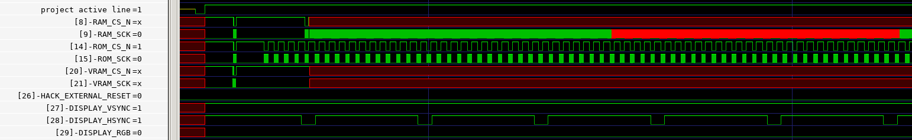
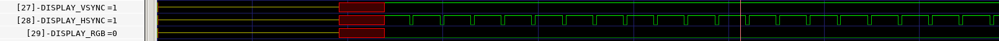
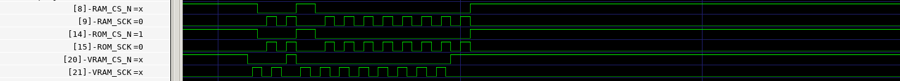
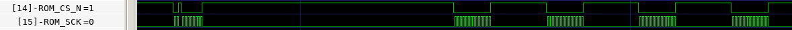

## **MPW2 silicon test: Wrapped Hack SoC project inside ZA mutli project**
---

### **MPRJ_IO Connections:**

// Hack External Reset (input)
MPRJ_IO[26]  ==> connect to GND

// DISPLAY_RGB (output)
MPRJ_IO[29] ==> connector to Logic Analyzer or Scope

// DISPLAY_HSYNC (output)
MPRJ_IO[28] ==> connector to Logic Analyzer or Scope

// DISPLAY_VSYNC (output)
MPRJ_IO[27] ==> connector to Logic Analyzer or Scope

// ROM_CS_N (output)
MPRJ_IO[14] ==> connector to Logic Analyzer or Scope

// ROM_CSK (output)
MPRJ_IO[15] ==> connector to Logic Analyzer or Scope

// RAM_CS_N (output)
MPRJ_IO[8] ==> connector to Logic Analyzer or Scope

// RAM_CSK (output)
MPRJ_IO[9] ==> connector to Logic Analyzer or Scope

---
### **Simulation outputs:**

### Overview

 
 

### Display Lines (HSYNC, VSYNC, RGB)

After project becomes active the first expected values would be:

`vsync` starts with 1 and flips to 0 with a period of `system_clock_period * 420,000` (16.8ms with a 25MHz clock)

`hsync` starts with 1 and flips to 0 with a period of `system_clock_period * 800` (32us with a 25MHz clock)

`rgb` it should start with 0 and it would become uncertain after a while if no external memories are connected

 
 

### External SRAM SPI lines

After the project becomes active it configures the 23LC1024 memories (ram, rom, vram) sending this commands.
For reference, all the clock (`sck`) lines have a pulse twice the length of the system clock period 

After the initilization, and without connecting the external 23LC1024 chips, the only lines that we can analyze are the ROM ones:

`rom_cs_n` the chip select line should have a period of `system_clock_period * 70` (2800ns with a 25MHz clock). That is the period of the HACK processor clock, in which the system should fetch a new instruction from ROM
`rom_csk` should have a period of `system_clock_period * 2` when active

