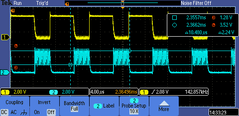
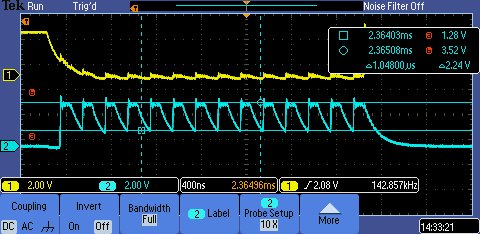

## Test with Matt's MPW2 chip 
---

Firmware: [wrapped_hack_soc_test_2-SILICON.c](wrapped_hack_soc_test_2-SILICON.c)

### Output from pins 14 (`ROM_CS_N`) and 15 (`ROM_CSK`)
---
Five ROM read cycles

One ROM read cycles

---

The timings seem correct: Caravel was running with a 10MHz clock, and the expected Hack SoC ROM read cycle was `system_clock_period * 70` >>> `100ns * 70 = 7000ns` >>> `142.8khz`

There was a slow falling edge of aprox. 400ns. With that slew and that clock cycle it wont be possible to use the 23LC1024

The output voltages also seemed to be off too:  min 1.28V max 3.52V

